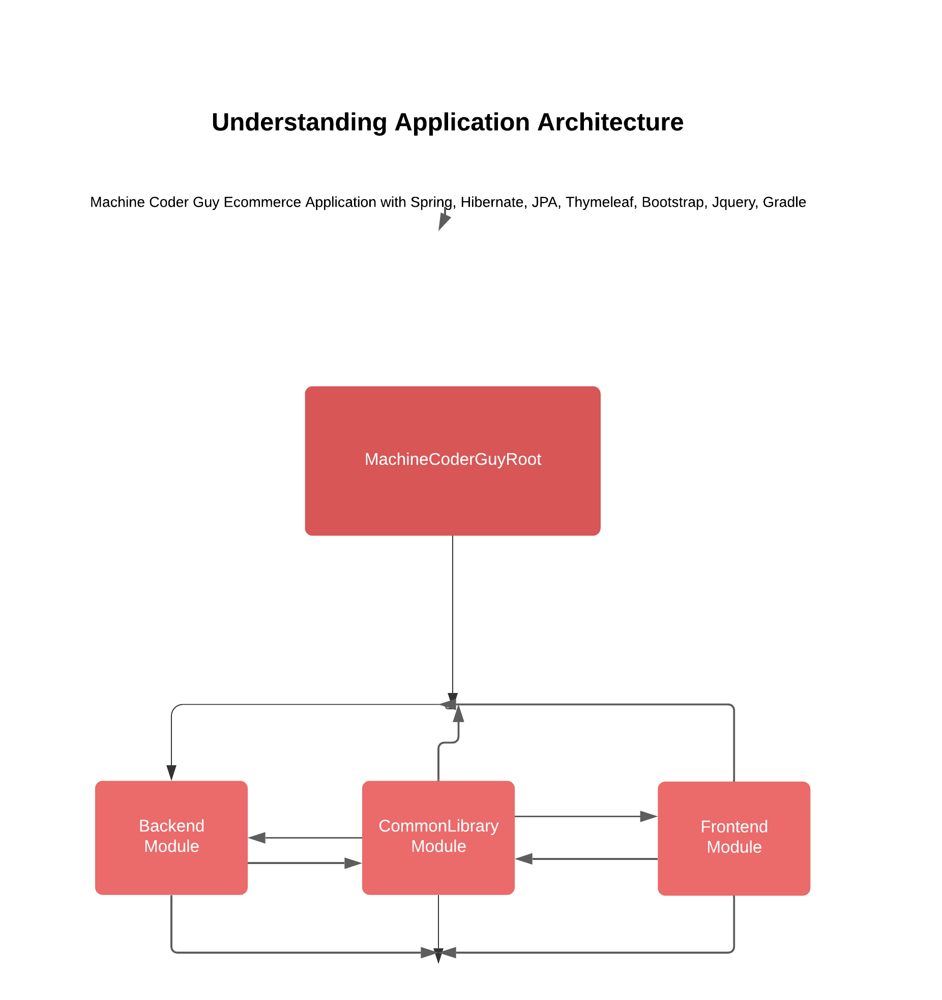

<h1> Machine Coder Guy Ecommerce Project </h1>

 
 

This application usages JPA as Data Layer, and this is performing CRUD operation.

 

For database I have choosen MySQL, and I have used Hibernate core as reference implementation.

 

BootStrap and Jquery to design application UI and I have used ThymeLeaf to properly link static resources with HTML.

 

This Project missing RestContoller, which I will create as separate module but I need some time for focus on implementation.

 
 

This project can help you understand multiple level module project with gradle and spring.

 
 

Show your support by contribute to this codebase! Let's make it better!
